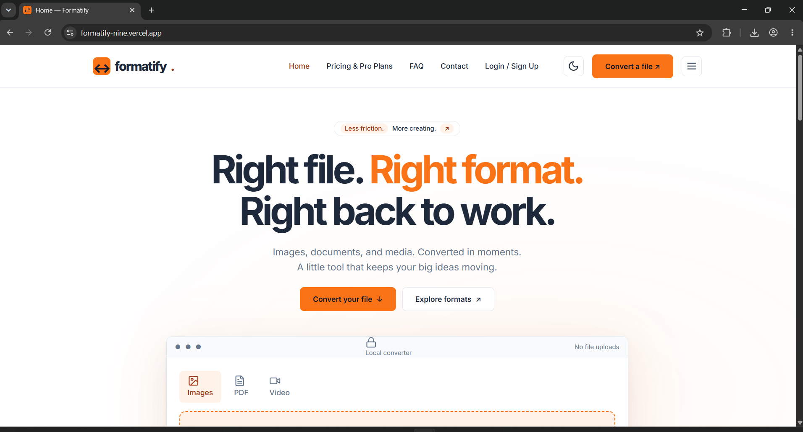

# 🔄 Formatify

**The 100% Privacy-Focused, Client-Side File Converter.**

[](#)
[](#)
[](#)
[](#)

Formatify is a modern, responsive web application built with React and Tailwind CSS. It allows users to convert files (Images, Videos, PDFs) entirely in their browser without uploading anything to a server, guaranteeing **100% user privacy**. 


*(Note: Replace `screenshot.png` in the public folder with a high-res image of the application)*

🚀 **Live Demo:** [formatify-nine.vercel.app](https://formatify-nine.vercel.app/)

---

## ✨ Key Features

*   **100% Client-Side Processing:** No server uploads. Absolute privacy. All files are processed locally on your device.
*   **Video Conversion:** Extracts MP3 from video and compresses/converts to MP4 using `FFmpeg.wasm`.
*   **PDF to Image:** Converts PDF documents into downloadable PNG/JPG images (page-by-page) using `PDF.js`.
*   **Image Conversion:** Seamlessly converts between JPG, PNG, WebP, and SVG using HTML5 Canvas.
*   **Modern UI/UX:** Responsive design, Dark/Light mode toggle, mobile-friendly hamburger menu, and FAQ accordions.
*   **Unified Application:** All five pages (Home, Pricing, FAQ, Contact, Login/Sign Up) are built as React components within a single Vite app.

---

## 🛠️ Tech Stack & Libraries

| Category | Technology / Library | Description |
| :--- | :--- | :--- |
| **Frontend Framework** | React + Vite | Fast, optimized client-side rendering and routing. |
| **Styling** | Tailwind CSS v4 | Utility-first CSS for modern, responsive UI. |
| **Icons** | Lucide React | Clean and consistent icon pack. |
| **Video Processing** | `@ffmpeg/ffmpeg` (v0.12.15) | WebAssembly-based FFmpeg for local video handling. |
| **PDF Processing** | `pdfjs-dist` (v6.3.289) | Client-side PDF rendering. |
| **Hosting & CI/CD** | Vercel | Automated deployments directly from GitHub. |

---

## 📂 Project Structure

*   `src/App.jsx`: Shared navigation, footer, theme, and React Router routes.
*   `src/pages/`: Contains all main route components (`Home.jsx`, `Pricing.jsx`, `FAQ.jsx`, `Contact.jsx`, `Account.jsx`).
*   `src/components/Converter.jsx`: Core React state for drag/drop, local conversion logic, and downloads.
*   `src/components/Icon.jsx`: Centralized Lucide React icons.
*   `src/styles.css`: Tailwind entry, theme tokens, and utility compositions.
*   `src/tokens.css`: Brand design tokens and local fonts.
*   `public/assets/`: All local images, icons, and fonts.
*   `vite.config.js`: Vite configuration with the Tailwind CSS plugin.

---

## 🚀 Local Setup & Installation

Follow these steps to run the project locally on your machine. Ensure you have **Node.js 22 or newer** installed.

**1. Clone the repository and install dependencies:**
```bash
npm install
